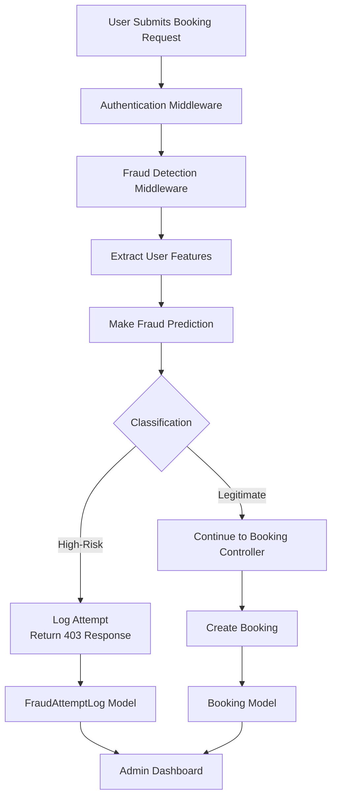

```mermaid
graph TD
    A[User Submits Booking Request] --> B[Authentication Middleware]
    B --> C[Fraud Detection Middleware]
    C --> D[Extract User Features]
    D --> E[Make Fraud Prediction]
    E --> F{Classification}
    F -->|High-Risk| G[Log Attempt<br/>Return 403 Response]
    F -->|Legitimate| H[Continue to Booking Controller]
    G --> I[FraudAttemptLog Model]
    H --> J[Create Booking]
    J --> K[Booking Model]
    I --> L[Admin Dashboard]
    K --> L
```